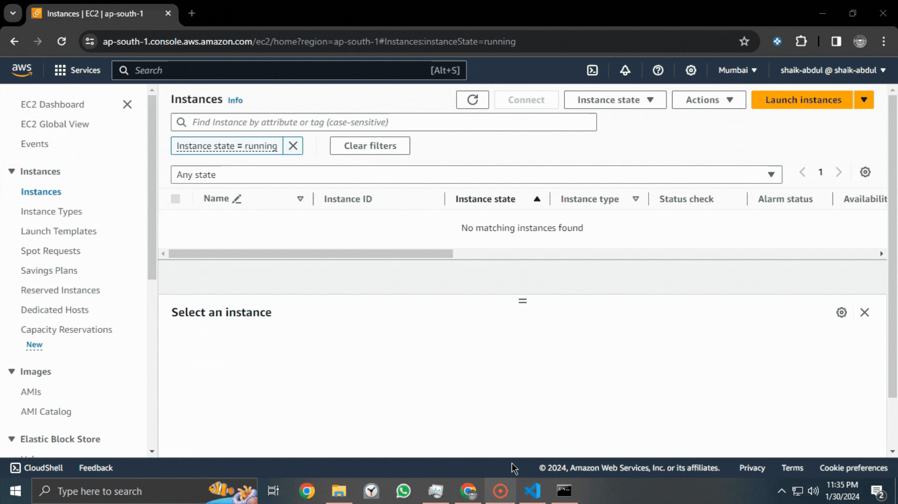

# Digital Options Trading Bot
Python Bot that uses AWS cloud to trade in digital options

 

 

## Overview
This project consists of a Python-based trading bot that interacts with AWS Cloud Services and IQ Options (Options Trading Platform) API, to process data, execute trades, record transactions in database and visualize results. 

## Components

### **main.py**
- The core script of the trading bot. It includes the logic for market interaction, time-based actions, and decision-making algorithms.
     
    
     
- This script runs on EC2 Instance on AWS Cloud Services.
- It integrates with the IQ Option API for trading actions. For more information on the IQ Option APi, click [here](https://github.com/iqoptionapi/iqoptionapi).
- Includes functions for starting actions at specific times and deciding the amount to trade based on a progression system.
     
    
     

- Manages DynamoDB interactions
     
    
     

### Setup
We have two methods to set up our AWS infrastructure:

(A) **Cloud Formation Template:** Utilize the 'aws_infrastructure.yaml' CloudFormation template to establish the necessary AWS resources. For step-by-step guide on how to deploy a CloudFormation Stack, check out this [link](https://docs.aws.amazon.com/AWSCloudFormation/latest/UserGuide/cfn-using-console.html). Following this, execute the 'run_cmds.py' script, which will SSH into the EC2 instance and initiate 'main.py'. 

(B) **Automated Script Method:** Alternatively, deploy the 'setup.py' script. This script automates the entire process: it creates the AWS resources, waits for their successful creation, then SSHs into the EC2 instance and executes 'main.py'."

  
    
     

### graph.py
- A script for visualizing data, possibly earnings or trading results, using `matplotlib` and `seaborn`.
- It retrieves data from an AWS DynamoDB table and plots a line graph showing earnings over transactions.
- The script is designed to handle 120 transactions.

  
    
     

## AWS Integration
- DynamoDB: Used for storing transaction or trading data.
- EC2: Hosts the trading bot and executes it in a cloud environment.
- The scripts assume certain AWS resources (like IAM roles, security groups) and access keys are already in place.

## Disclaimer
This is a high-level overview based on the scripts provided and the project is intended for educational purpose only. Note that 'practice' account is used in this project and that trading and investments are subject to market risk. Please avoid using real account and change to 'practice' account.  
